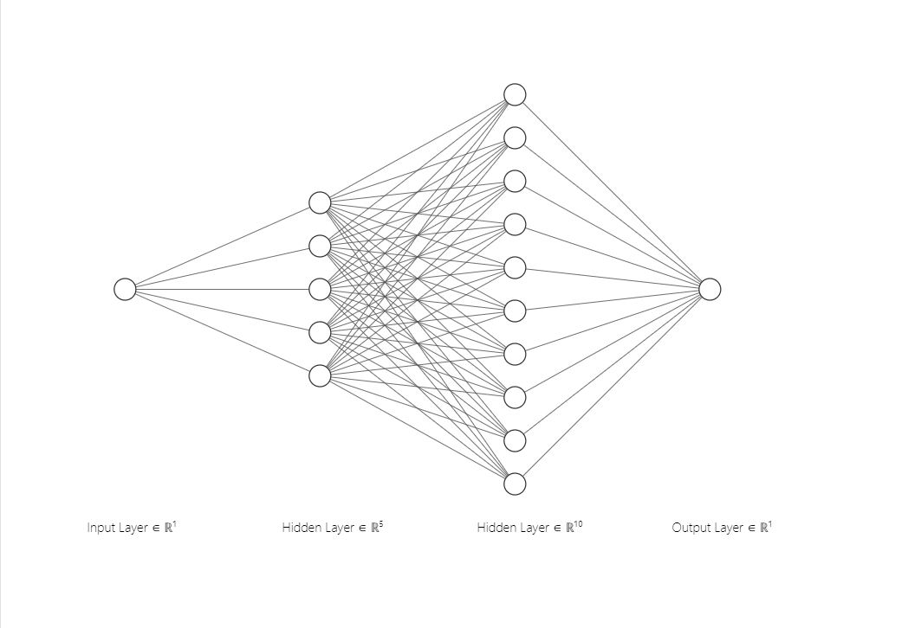
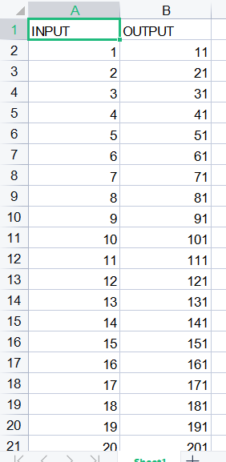
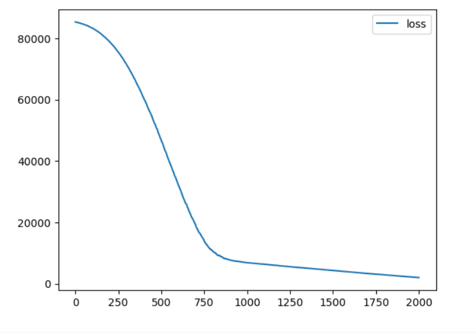
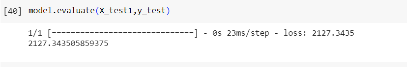
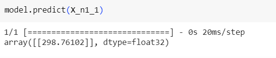

# Developing a Neural Network Regression Model

## AIM

To develop a neural network regression model for the given dataset.

## THEORY

Explain the problem statement

## Neural Network Model



## DESIGN STEPS

### STEP 1:

Loading the dataset

### STEP 2:

Split the dataset into training and testing

### STEP 3:

Create MinMaxScalar objects ,fit the model and transform the data.

### STEP 4:

Build the Neural Network Model and compile the model.

### STEP 5:

Train the model with the training data.

### STEP 6:

Plot the performance plot

### STEP 7:

Evaluate the model with the testing data.

## PROGRAM

```
import pandas as pd

from google.colab import auth
import gspread
from google.auth import default

auth.authenticate_user()
creds, _ = default()
gc = gspread.authorize(creds)

worksheet = gc.open('EXP1').sheet1
rows = worksheet.get_all_values()

df = pd.DataFrame(rows[1:], columns=rows[0])
df = df.astype({'INPUT':'float'})
df = df.astype({'OUTPUT':'float'})
df.head()

X = df[['INPUT']].values
y = df[['OUTPUT']].values

from sklearn.model_selection import train_test_split
X_train,X_test,y_train,y_test = train_test_split(X,y,test_size = 0.33,random_state = 33)

from sklearn.preprocessing import MinMaxScaler
Scaler = MinMaxScaler()
Scaler.fit(X_train)

X_train1 = Scaler.transform(X_train)

from tensorflow.keras.models import Sequential
from tensorflow.keras.layers import Dense

model = Sequential([
    Dense(5,activation = 'relu'),
    Dense(10,activation = 'relu'),
    Dense(1)
])

model.compile(optimizer = 'rmsprop', loss = 'mse' )

model.fit(X_train1, y_train, epochs=2000)

loss_df = pd.DataFrame(model.history.history)

loss_df.plot()

X_test1 = Scaler.transform(X_test)

model.evaluate(X_test1,y_test)

X_n1 = [[30]]

X_n1_1 = Scaler.transform(X_n1)

model.predict(X_n1_1)


```

## Dataset Information



## OUTPUT

### Training Loss Vs Iteration Plot



### Test Data Root Mean Squared Error



### New Sample Data Prediction



## RESULT
Thus, a neural network regression model for the given dataset is written and executed successfully.
